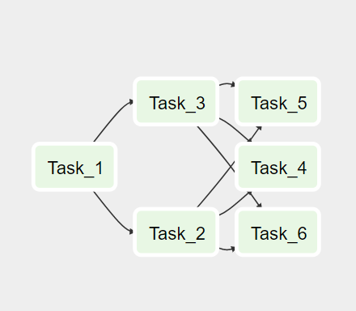

# Data Engineering Coding Challenge

The code has been written using python and pyspark
it has been pushed to the git repo 

For the task1_5 it has been tested with airflow webserver:

Test scenarios have been written using pytest library, every file has been also tested with pylint to make sure it follows PEP-8 best practices. 